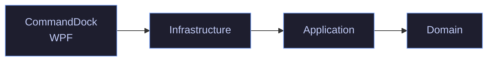

<div align="center">

# CommandDock

**A tidy launcher for the PowerShell commands you actually use.**

*Save them. Search them. Run them. Watch the output stream live — no terminal, no notes app, no `Get-History | Select-String`.*

<br />


<br />

<sub>Built with WPF, EF Core + SQLite, and CommunityToolkit.Mvvm on .NET 10.</sub>

</div>

---

## Contents

- [Why CommandDock?](#why-commanddock)
- [Screenshots](#screenshots)
- [Features](#features)
- [Getting started](#getting-started)
- [Using CommandDock](#using-commanddock)
- [Keyboard shortcuts](#keyboard-shortcuts)
- [How it works](#how-it-works)
- [Architecture](#architecture)
- [Building from source](#building-from-source)
- [Security](#security)
- [Roadmap](#roadmap)

---

## Why CommandDock?

If you're a developer or ops person on Windows, you probably have a mental list of PowerShell one-liners you run over and over: rebuild this, tail that log, restart that service, prune Docker, sync a repo. They live in a notes file, a scratch script, or worse — your shell history.

**CommandDock** turns that list into a searchable, clickable panel. Each command gets a name, an emoji icon, an optional description, and a script body. You pick it, hit **Run**, and the output streams into the app as it happens. Cancel with a keystroke.

> [!NOTE]
> CommandDock is intentionally small. It's a launcher, not a shell replacement. It doesn't try to be an IDE, a terminal multiplexer, or a build system.

---

## Screenshots

<div align="center">

> _Add screenshots into a `docs/` folder and reference them here:_
>
> ```markdown
> 
> 
> ```

</div>

---

## Features

- **Named command library.** Each entry has a name, optional emoji icon (defaults to 🔷), an optional description, and the PowerShell script itself.
- **Live streaming output.** Stdout and stderr are captured as the script produces them; stderr lines render in a distinct color so failures are obvious.
- **Instant cancellation.** `Ctrl+.` (or the Stop button) kills the entire process tree — safe for long-running or misfired commands.
- **Incremental search.** Filters the list as you type across name, description, and script text.
- **Keyboard-first.** Every action has a shortcut. Double-click also runs.
- **Local & private.** Commands are stored in a local SQLite database. No cloud, no telemetry, no network calls.
- **Dark theme.** Consistent theming through a single resource dictionary.
- **UTF-8 clean.** Non-ASCII output renders correctly — no mojibake from `powershell.exe`.

---

## Getting started

> [!NOTE]
> There's no installer or packaged release yet — building from source is currently the only way to run CommandDock. See [Building from source](#building-from-source).

### Requirements

| | |
| --- | --- |
| **OS** | Windows 10 (1809+) or Windows 11 |
| **SDK** | [.NET 10 SDK](https://dotnet.microsoft.com/download/dotnet/10.0) — needed to build; a plain [.NET 10 Desktop Runtime](https://dotnet.microsoft.com/download/dotnet/10.0) is enough only if you use the self-contained publish output below |
| **Shell** | Windows PowerShell 5.1 (bundled with Windows) |

On first launch, CommandDock creates its database at:

```
%LOCALAPPDATA%\CommandDock\commanddock.db
```

The command list starts empty.

---

## Using CommandDock

### Create a command

Press `Ctrl+N` (or click **New**) and fill in:

| Field | Required | Notes |
| --- | :---: | --- |
| **Name** | ✅ | Shown in the list and used for sort/search. |
| **Icon** | — | A single emoji works best (e.g. `📦`, `🧹`, `🐳`). Empty → defaults to 🔷. |
| **Description** | — | One-line hint shown under the name in the list. |
| **Command** | ✅ | The PowerShell script. Multi-line supported. |

Edits are only persisted when you press **OK** — cancel keeps the original untouched.

### Edit or delete

- **Edit:** select the command → `Ctrl+E`, or use the **⋮** menu on the list item.
- **Delete:** use the **⋮** menu → **Delete**. You'll be asked to confirm.

### Run a command

Select it, then any of:

- Press `Ctrl+Enter`
- Click **▶ Run**
- Double-click the list item

Output streams into the console pane on the right. The status bar reports the outcome:

| Status message | Meaning |
| --- | --- |
| `Exit code 0 in 1.24 s.` | Completed successfully. |
| `Exit code 1 in 0.35 s.` | Completed with a non-zero exit code. |
| `Cancelled after 4.10 s.` | You stopped it with `Ctrl+.`. |
| `Failed.` | The process could not be started or an unexpected exception occurred (details appear in the console as an error line). |

### Search

Press `Ctrl+F` to focus the search box. The list filters live across **name**, **description**, and **script text**. Press `Escape` in the search box to clear it and return focus to the list.

---

## Keyboard shortcuts

| Shortcut       | Action                       |
| -------------- | ---------------------------- |
| `Ctrl+N`       | New command                  |
| `Ctrl+E`       | Edit selected command        |
| `Ctrl+Return`  | Run selected command         |
| `Ctrl+.`       | Stop running command         |
| `Ctrl+L`       | Clear output                 |
| `Ctrl+F`       | Focus search                 |
| `Escape`       | Clear search (in search box) |
| Double-click   | Run selected command         |

---

## How it works

### Command execution

CommandDock does **not** host a PowerShell runtime in-process. Each Run action spawns a fresh `powershell.exe` child process configured for clean, non-interactive execution:

- **`-NoProfile`** — user/system profiles are skipped for predictable behavior and faster startup.
- **`-NonInteractive`** — prompts are disabled; commands that would block for input fail rather than hang.
- **`-EncodedCommand`** — the script body is passed as a Base64-encoded UTF-16LE string, avoiding all shell-quoting pitfalls (quotes, backticks, ampersands, newlines pass through untouched).
- **UTF-8 I/O.** Both `$OutputEncoding` and `[Console]::OutputEncoding` are set to UTF-8 inside the child process, and the parent redirects stdout/stderr as UTF-8 — non-ASCII output renders correctly.

Output is captured asynchronously via `OutputDataReceived` / `ErrorDataReceived` and marshaled to the UI thread. Cancellation calls `Process.Kill(entireProcessTree: true)` so any child processes the script spawned are terminated too.

Implementation: [src/CommandDock.Infrastructure/PowerShell/PowerShellRunner.cs](src/CommandDock.Infrastructure/PowerShell/PowerShellRunner.cs).

### Where your commands are stored

| | |
| --- | --- |
| **Location** | `%LOCALAPPDATA%\CommandDock\commanddock.db` |
| **Format** | SQLite, managed via Entity Framework Core |
| **Schema** | A single `Commands` table: `Id` (GUID), `Name`, `Icon`, `Description`, `CommandText`, `CreatedUtc`, `UpdatedUtc` |

To **back up** your commands, copy the `.db` file. To **reset** the app, delete it — CommandDock recreates an empty database on the next launch.

> [!WARNING]
> The database is **not encrypted**. See [Security](#security) before storing sensitive scripts.

---

## Architecture

CommandDock follows a small Clean Architecture layout with strict inward-only dependencies:



| Project | Responsibility |
| --- | --- |
| **CommandDock.Domain** | Entities and value objects. Zero dependencies. Contains `CommandDefinition`, `OutputLine`, `ExecutionResult`, `OutputStream`. |
| **CommandDock.Application** | Abstractions only: `IRunner` (execute a command with a streaming output callback) and `ICommandRepository` (CRUD over commands). |
| **CommandDock.Infrastructure** | Concrete adapters: `PowerShellRunner` (child-process based), `CommandRepository` + `CommandDockDbContext` (EF Core + SQLite). |
| **CommandDock** (WPF) | Presentation. `App.OnStartup` is the DI composition root. ViewModels use `CommunityToolkit.Mvvm` (`[ObservableProperty]`, `[RelayCommand]`). |

---

## Building from source

### Prerequisites

- Windows 10/11
- [.NET 10 SDK](https://dotnet.microsoft.com/download/dotnet/10.0)
- Optional: Visual Studio 2022 (17.11+) or JetBrains Rider for the WPF designer

### Common commands

```powershell
# Restore + build (Debug)
dotnet build CommandDock.slnx

# Run the app
dotnet run --project src/CommandDock/CommandDock.csproj

# Release build
dotnet build CommandDock.slnx -c Release
```

<details>
<summary><strong>Publish a self-contained single-file exe</strong></summary>

```powershell
dotnet publish src/CommandDock/CommandDock.csproj `
    -c Release `
    -r win-x64 `
    --self-contained true `
    -p:PublishSingleFile=true
```

The output lands in `src/CommandDock/bin/Release/net10.0-windows/win-x64/publish/`.

</details>

> [!NOTE]
> There are no automated tests in the repository yet — see [Roadmap](#roadmap).

---

## Security

CommandDock runs **arbitrary code that you have written and chosen to save**. Keep the following in mind:

> [!CAUTION]
> - **Commands run with your user privileges.** Anything you can do in a normal PowerShell session, a saved command can do — including deleting files, modifying the registry, and reaching the network.
> - **The database is not encrypted.** Any process or user with access to your `%LOCALAPPDATA%\CommandDock` folder can read or modify stored scripts. **Do not store secrets** (passwords, tokens, connection strings) inline. Reference environment variables, Windows Credential Manager, or a dedicated secret store instead.
> - **Do not import commands from untrusted sources.** Treat a `.db` file from someone else the same way you'd treat an unknown `.ps1` — inspect the scripts before running them.

`-NonInteractive` is always enforced, so commands cannot prompt for interactive input; scripts that require it will fail immediately rather than hang.

---

## Roadmap

Not committed to, but plausible directions:

- [ ] Parameterized commands (prompt for values before running)
- [ ] Pinned favorites / grouping / tagging
- [ ] Execution history and persistent logs
- [ ] PowerShell 7 (`pwsh.exe`) support, or per-command runner selection
- [ ] Import/export commands as JSON or `.ps1` files
- [ ] Proper EF Core migrations (replace `EnsureCreated` + ad-hoc `ALTER TABLE`)
- [ ] Unit tests around `MainViewModel` and an integration test for `PowerShellRunner`
- [ ] Packaged releases (self-contained `.exe` or an installer) instead of build-from-source only
- [ ] Light theme / theme switching
- [ ] Portable mode (database next to the executable)
